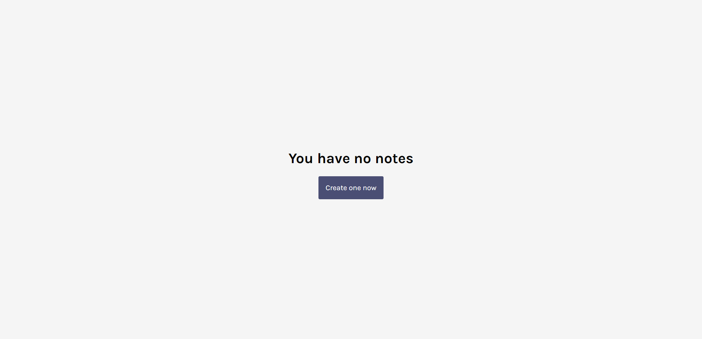
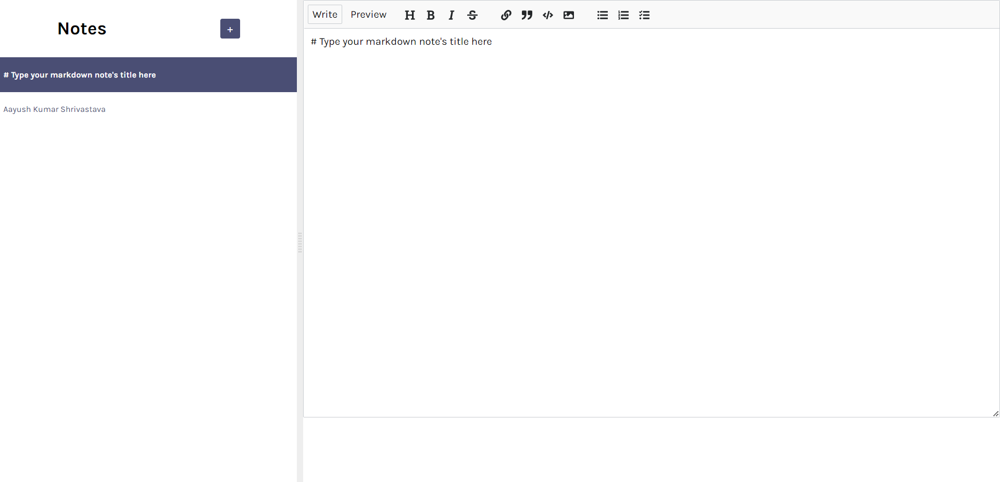

# Markdown Notes App
This is a notes keeping solution. Users can store their notes on the browser's local storage, with easy access to the most recent edited notes. The project has a markdown editor, so user can easily switch between write and preview mode.

Deployed Link: https://notes-app01.netlify.app/

## My Contribution and Learnings
This project uses a package called React-MDE. I added sync feature to this app so that the notes can be saved in the browser's local storage. I also added the note summary titles feature to it. Along with that, I also enabled the feature to move the modified notes to the top of the list. The delete note feature is also added by me.

## Technology and Tools Used
Create-React-App environment, JavaSCript, CSS, and HTML.
